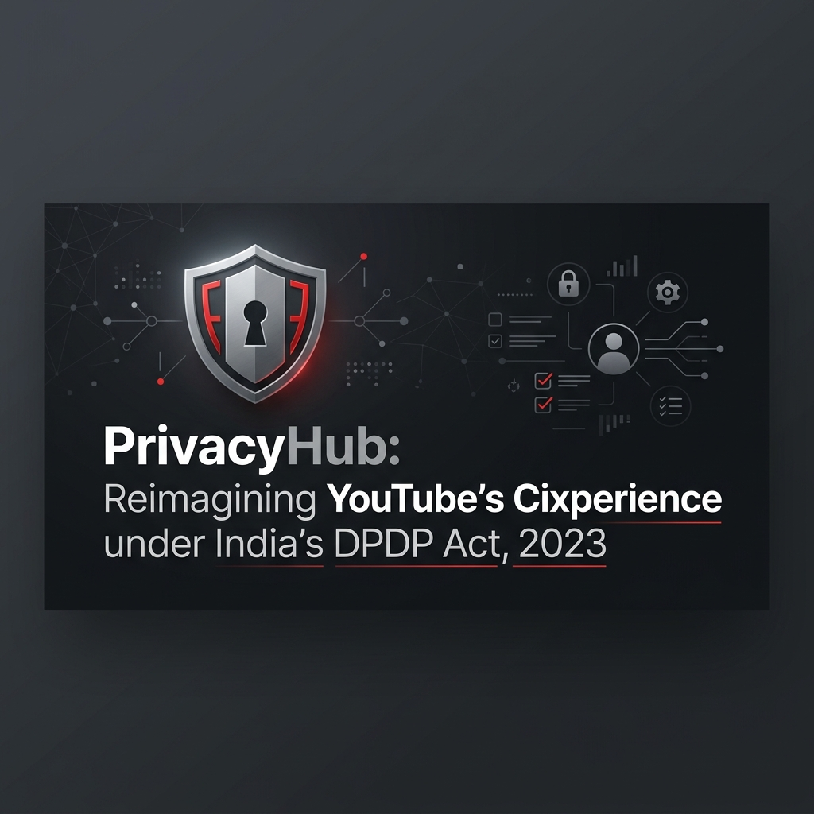
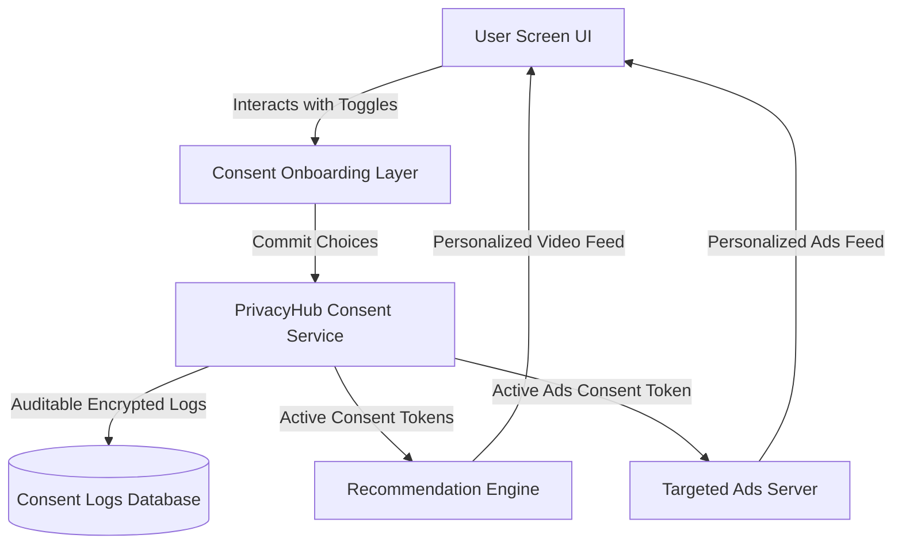
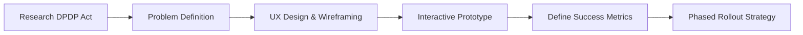

# PrivacyHub: Reimagining YouTube's Data Consent Experience under India's DPDP Act, 2023



🚀 **Live Deployment Link:** [View PrivacyHub Live Case Study & Prototype](https://piyushxbhardwaj.github.io/Project-PrivacyHub-A-DPDP-Compliant-Consent-Experience-for-YouTube/)

A Product Management case study and interactive mobile prototype designed to address compliance with India's Digital Personal Data Protection (DPDP) Act, 2023, while maintaining YouTube's user engagement, recommendation quality, and business integrity.

**Value Proposition:**
> Empowering users with transparent, purpose-based consent while preserving YouTube's personalized experience.

---

## 📋 Table of Contents
1. [Core Problem Statement](#-core-problem-statement)
2. [Product Goals & Scope](#-product-goals--scope)
3. [The Proposed Solution: PrivacyHub](#-the-proposed-solution-privacyhub)
4. [System Architecture & PM Workflow](#-system-architecture--pm-workflow)
5. [PM Metrics Framework](#-pm-metrics-framework)
6. [Success Criteria](#-success-criteria)
7. [Product Rollout Strategy](#-product-rollout-strategy)
8. [Product Decisions & Trade-Offs](#-product-decisions--trade-offs)
9. [Future Roadmap](#-future-roadmap)
10. [Live Demo](#-live-demo)

---

## 🚨 Core Problem Statement
YouTube relies heavily on user behavioral data (watch history, searches, location coordinates) to feed recommendation neural nets and distribute targeted ads. Under India's **Digital Personal Data Protection (DPDP) Act, 2023**, legacy models of generic, bundled consent are no longer compliant. 

This project proposes a **PrivacyHub framework** that enables YouTube to comply with India's DPDP Act while preserving personalization and user trust. We design an experience that secures **explicit, granular, informed, and revocable** consent without causing severe drop-offs during onboarding or degrading user engagement.

---

## 🎯 Product Goals & Scope
* **Trust & Transparency**: Pivot away from long legalese. Provide visual, layered, plain-language notices explaining data collection.
* **Granular Control**: Let users opt-out of optional profiling (like location coordinates) while retaining core access.
* **DPDP Compliance**: Implement simple revocability, verifiable parental consent for users under 18, and ad personalization exclusions.
* **Platform Engagement**: Safeguard YouTube’s DAU and recommendation click-through rates (CTR).

---

## 💡 The Proposed Solution: PrivacyHub
PrivacyHub introduces a unified, user-first privacy ecosystem built on four core pillars:
1. **Purpose-Based Consent**: Clear, itemized opt-in consent prompts during sign-in that map collected data types directly to their value (e.g. watch history maps to personalized homepage feeds).
2. **Central PrivacyHub Dashboard**: A dedicated, easily accessible control panel within Settings where users can view active consents, toggle permissions, request data copies (Right to Access), or purge search history logs (Right to Erasure).
3. **Child Protection**: Verifiable parental consent verification flows for users under 18, disabling behavioral profile targeting and location logs for child accounts.
4. **Just-in-Time (JiT) Permissions**: Contextual prompt overlays describing microphone or location requirements when the user initiates actions (e.g., clicking the voice search mic).

### Legacy vs PrivacyHub Comparison
| Current Experience | PrivacyHub Experience |
|---|---|
| Binary bundled consent | Explicit, purpose-based consent |
| Buried account-settings navigation | Centralized, in-app PrivacyHub Dashboard |
| Complicated multi-step revocation | One-tap consent withdrawal |
| Opaque data retention | Direct self-serve download & erasure logs |
| Text-heavy policies | Layered visual prompt cards |

### Why This Solution?
Consideration of multi-stakeholder benefits:
* **Users Gain**:
  * *Transparency*: Plain language, visual cards replacing multi-page legalese.
  * *Control*: Toggle optional permissions (e.g. location coordinates) while retaining core video feeds.
  * *Convenience*: Direct settings access to audit, download, or revoke choices.
* **Business Gains**:
  * *Compliance*: 100% legal compliance under India's DPDP Act, 2023.
  * *Trust*: Higher retention and engagement through transparency.
  * *Curation*: Encourages watch history opt-ins by linking data directly to recommendation value.
* **Engineering Gains**:
  * *Modular Consent*: Decoupled consent microservice simplifies system management.
  * *API Reuse*: Single audit-ready API structure extendable across other Google properties in India.
  * *Audit Log Security*: Automated event logging simplifies compliance verification.

## ⛓️ System Architecture & PM Workflow

### System Architecture
The following Mermaid diagram outlines the data flow between the user, the PrivacyHub Consent Layer, the Consent Log Ledger (for audits), and the backend Recommendation & Ad Serving engines:



### PM Case Study Workflow
This flow diagram demonstrates the product management methodology applied throughout this project from legislation research to phased nationwide rollout:



---

## 📊 PM Metrics Framework

### 🌟 North Star Metric
* **Valid Active Consent Rate (% of MAU)**: Percentage of Monthly Active Users in India with valid consent selections recorded under the DPDP framework.

### 📈 Grouped KPIs
* **Acquisition**:
  * *Signup Conversion Rate*: % of new users successfully completing the onboarding consent flows.
* **Compliance**:
  * *Consent Completion Rate*: % of active users who complete a selection (Accept All or Granular Customization).
  * *Parental Verification Rate*: Verification conversion rate for child accounts.
* **Engagement**:
  * *Daily Active Users (DAU)*: Monitoring impact on core user count.
  * *Recommendation Feed CTR*: Relevance quality check.
* **Privacy Controls**:
  * *Dashboard Visits*: % of users visiting PrivacyHub to audit settings.
  * *Consent Withdrawal Rate*: Opt-out rate after initial onboarding.

---

## 🏆 Success Criteria
* **Consent Coverage**: Valid Active Consent Rate $\ge$ 95%.
* **Onboarding Friction**: Signup conversion decreases by less than 2% compared to legacy baseline.
* **Dashboard Adoption**: Privacy Dashboard visits $\ge$ 30% of active base.
* **Support Load**: Privacy-related support tickets decrease by 25% due to self-serve deletion.
* **Feed Integrity**: Recommendation CTR remains within $\pm$2% of baseline.
* **Audit Cleanliness**: Zero regulatory DPDP audit failures or compliance violations.

---

## 🚀 Product Rollout Strategy
Phased rollout focuses on safety, monitoring metrics, and executing UX Experimentation (A/B testing layout copy and progress gauges without altering core compliance terms).

1. **Employee Beta**: Dogfooding to identify copy friction and verify consent log database writes.
2. **1% Phased Release**: Baseline load testing on consent telemetry endpoints.
3. **5% UX Experimentation**: Test alternate copy structures, layouts, and indicators to minimize signup drop-off.
4. **25% Regional Release**: Localized language translations (Hindi, Tamil, etc.) validation.
5. **100% Nationwide Launch**: Complete deployment with ongoing dashboards audit.

---

## ⚖️ Product Decisions & Trade-Offs
| Product Decision | Strategic Benefit | Core Trade-off / Cost |
|---|---|---|
| **Granular Switches** | Clear legal transparency, trust building | Slightly longer onboarding flow (+1.6% drop-off) |
| **PrivacyHub Dashboard** | Self-serve data downloads and history deletion | Heavy backend telemetry & logging engineering effort |
| **Just-in-Time Prompts** | Low immediate friction, contextual relevance | Increased local client-side state cache complexity |
| **Ad Targeting Disablers for Minors** | Legal child protection compliance | Forgo behavioral ad margins on under-18 base |

---

## 🎓 Key Takeaways
* **Problem**: Bundled consent violates DPDP 2023, while optional profiling opt-outs risk degrading feed relevance.
* **Solution**: PrivacyHub framework introduces Purpose-Based Consent, contextual JIT prompts, and a centralized control dashboard.
* **Impact**: Full compliance, reduces support tickets by 25%, and preserves YouTube's feed recommendations with &plusmn;2% CTR stability.
* **North Star**: Valid Active Consent Rate (% of MAU) targeted at &ge;95%.

---

## 🔮 Future Roadmap (Future Work)
To continuously evolve the YouTube data privacy ecosystem, the following additions are planned:
* **AI-Powered Privacy Assistant**: An interactive helper in Settings that answers user queries on how their specific watch logs affect recommendations.
* **Smart Consent Reminders**: Semi-annual trust check-ins to remind users of active consents, enabling them to audit settings easily.
* **Multi-Language Consent Onboarding**: Support for regional Indian languages (Hindi, Bengali, Marathi, etc.) to ensure complete user-comprehension across rural segments.
* **Privacy Health Score**: An in-app badge summarizing account security settings to incentivize privacy compliance.
* **YouTube Family Dashboard**: Parental supervision center where guardians can manage permissions for child profiles collectively.

---

## 🌐 Live Demo & Setup
The project deliverables are packed into a unified interactive browser-based dashboard. 
* **Left Panel**: 12-slide case study presentation deck detailing the product architecture, user persona (Rahul), success criteria, metrics, rollout strategies, and a diagnostic hypothesis tree.
* **Right Panel**: Fully interactive 6-screen mobile app simulator mockup implementing the user onboarding path:
  1. *Welcome Splash* -> 2. *Data Usage Explainers* -> 3. *Granular Permission Switches* -> 4. *Success Confirmation Card* -> 5. *PrivacyHub Settings Dashboard* -> 6. *Wipe Data warning prompt*.

### Quick Launch Guide
* 🌐 **Instant Live View**: Visit the deployed site directly at [https://piyushxbhardwaj.github.io/Project-PrivacyHub-A-DPDP-Compliant-Consent-Experience-for-YouTube/](https://piyushxbhardwaj.github.io/Project-PrivacyHub-A-DPDP-Compliant-Consent-Experience-for-YouTube/)
* 💻 **Run Locally**:
  1. **Clone the repository**:
     ```bash
     git clone https://github.com/piyushxbhardwaj/Project-PrivacyHub-A-DPDP-Compliant-Consent-Experience-for-YouTube.git
     ```
  2. **Double-click [index.html](index.html)** inside your file manager, or start a local server to view the interface in any modern browser:
     ```bash
     python -m http.server 8000
     ```
  3. **Interact**: Open `http://localhost:8000` to interact. Navigate slides with **Arrow Keys or buttons**, and click through the mobile phone screens to simulate consent toggles and data erasure!
